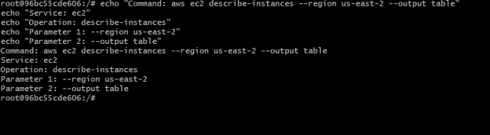
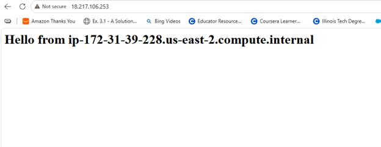
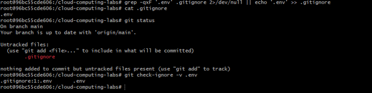
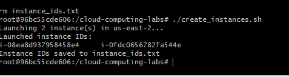
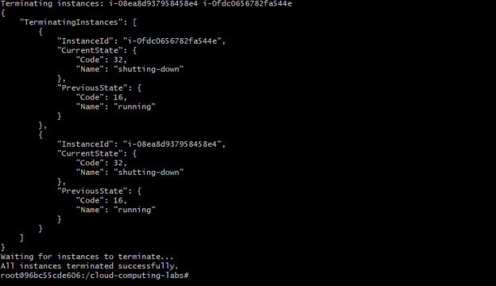

# AWS CLI, EC2 Instances, and Environment-Based Scripting

## 1. AWS CLI Command Structure

The following screenshot shows the `aws ec2 describe-instances` command decomposed into its service, operation, and parameters.

---

## 2. EC2 Web Server

The following screenshot confirms that the configured EC2 instance successfully launched the Apache web server using the user-data script.

---

## 3. Environment File Protection

The following screenshot shows that `.env` is included in `.gitignore` and is not tracked by Git.

---

## 4. Creating EC2 Instances

The following screenshot shows `create_instances.sh` successfully launching two EC2 instances and returning both instance IDs.

---

## 5. Terminating EC2 Instances

The following screenshot shows `delete_instances.sh` successfully terminating both EC2 instances and confirming that the termination process completed.

---

## GitHub Repository

The scripts and configuration template used in this lab are available in the course repository:

[Cloud Computing Labs GitHub Repository](https://github.com/qsamson/cloud-computing-labs)

The repository includes:

- `create_instances.sh`
- `delete_instances.sh`
- `.env.example`
- `.gitignore`

The actual `.env` file is intentionally excluded from the repository.

---

## Security Reflection

Environment files should be excluded from Git because they may contain sensitive credentials, API keys, passwords, account-specific configuration values, or other information that should not be publicly exposed. Even when a repository is private, access can accidentally be granted to others, the repository could later become public, or credentials could be exposed through account compromise. Keeping `.env` files outside version control reduces the risk of leaking sensitive information and allows configuration values to remain separate from application code.
