# Step 01 : AWS Account, IAM User, MFA, and Access Keys

## Root User MFA Enabled

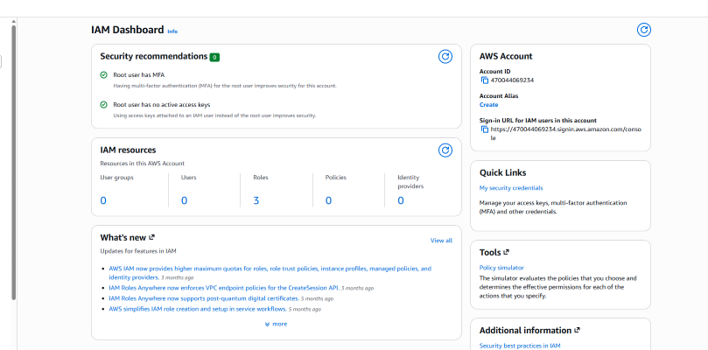

## IAM User Created

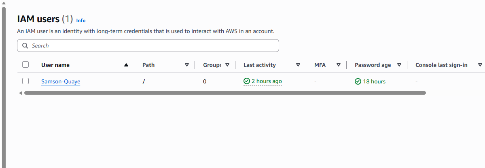

## IAM User MFA Enabled

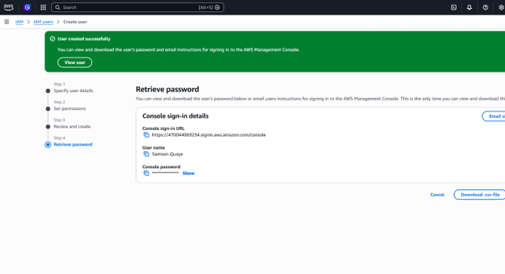

## Access Key Confirmation

Access key successfully created for the IAM lab user.

**Access Key:** `AKIA****…**** (last 4 chars:DZWG)`

## Security Reflection

Root user MFA is important because the root account has unrestricted access to all AWS resources, billing information, and security settings. Enabling MFA adds an extra layer of protection beyond the password and reduces the risk of unauthorized access. Using a least-privilege IAM user for everyday tasks is also important because it limits the permissions available to only those needed for the work being performed. This reduces the potential damage if the IAM user's credentials are compromised and helps protect the overall AWS environment.

---

# Step 02 : Docker and Ubuntu Linux Container Setup

## Docker Version

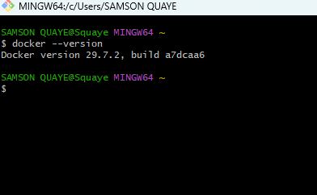

## Hello World Container

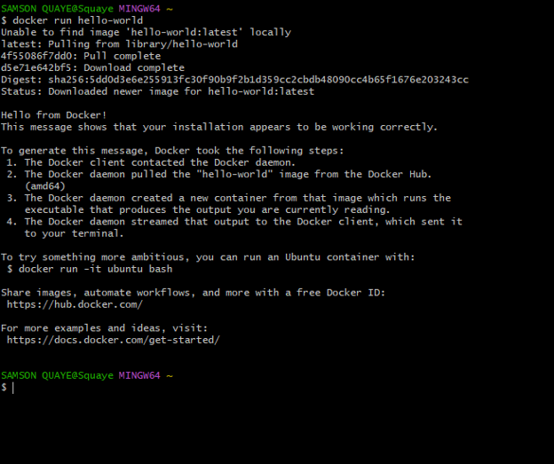

## Ubuntu Container Verification

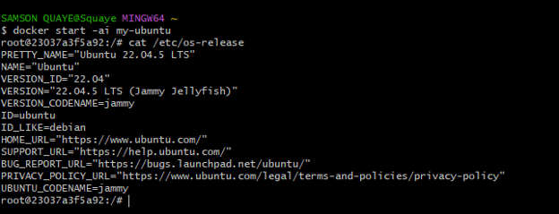

## Docker Containers Before Removing `my-ubuntu`

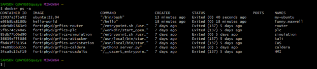

## Docker Containers After Removing `my-ubuntu`

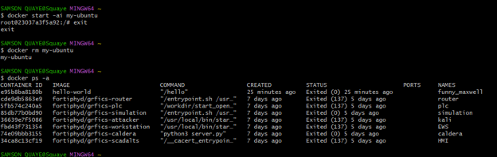

## Docker Image vs. Docker Container

A Docker image is like a blueprint or template that contains the files and software needed to create a container. The image itself does not run; it is used to create containers. A Docker container is an actual running or stopped instance created from that image. Containers are lightweight and isolated from the main operating system, which makes them useful for running applications consistently on different computers.

---

# Step 03 : AWS CLI and GitHub Configuration Inside Docker

## AWS CLI Version

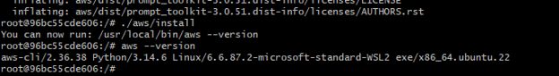

## AWS IAM Authentication

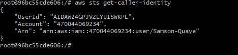

## Git Configuration

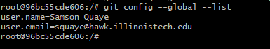

## GitHub Repository

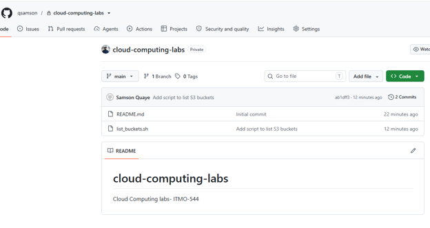

## Security Reflection

AWS credentials and GitHub tokens should never be committed to a repository because they are sensitive credentials that can give someone access to your cloud account or GitHub resources. If they are exposed, another person could use them to access services, modify or delete resources, or make unauthorized changes. Even in a private repository, credentials can still be accidentally shared or exposed, so they should always be stored securely and kept separate from source code.
